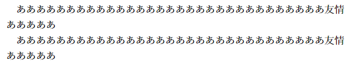
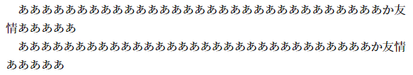
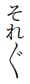
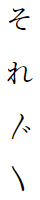
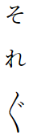
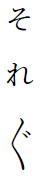
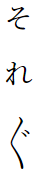

# Whitespace and line breaks

## Glues and kerns

First, let's distinguish between the TeX concepts *glue* and *kern*:

- A glue is a unit of flexible-width whitespace, consisting of a natural width, as well as optional strech and shrink values. Glues can be discarded and replaced with line breaks. One way of manually inserting a glue is with `\hskip`.

- A kern is a unit of fixed-width whitespace. Kerns cannot strech or shrink, nor be replaced with line breaks. Kerns can therefore be used to bind characters together as an inseparable block. They can be manually inserted with `\kern`.

Notice how the following two paragraphs differ only in terms of whether a glue or a kern is inserted:

```latex
\documentclass{ltjarticle}
\begin{document}
    あああああああああああああああああああああああああああああああ%
    友\hskip0pt情%
    あああああ

    あああああああああああああああああああああああああああああああ%
    友\kern0pt情%
    あああああ
\end{document}
```

The output is identical.



Now, note what happens when an additional fullwidth character is inserted:

```latex
\documentclass{ltjarticle}
\begin{document}
    あああああああああああああああああああああああああああああああ%
    か友\hskip0pt情%
    あああああ

    あああああああああああああああああああああああああああああああ%
    か友\kern0pt情%
    あああああ
\end{document}
```

The glue in second line was shrunk, as the line could not be broken on a kern.



## Spacing and line breaks in pTeX-like engines

The spacing between two characters when using a pTeX-like engine is determined as follows:

- Between two *JAchars* (Japanese characters):
  1. The font metric can specify glues/kerns of different widths to be inserted for specific combinations of character classes.
  2. If nothing is specified by the font metric, a glue called *kanjiskip* is inserted.

- Between a *JAchar* and an *ALchar* (alphabetic character):
  1. The *xsp* settings of the two characters determine if anything is inserted at all. These are controlled via:
      - *JAchars:* `inhibitxspcode` in (u)pTeX and `jaxspmode` in LuaTeX.
      - *ALchars:* `xspcode` in (u)pTeX and `alxspmode` in LuaTeX.
  2. If the *xsp* settings of both characters allow it, a glue called *xkanjiskip* is inserted.

Since *(x)kanjiskips* are glues, they can normally be replaced with line breaks. Japanese kinsoku (illegal linebreak) rules are implemented through the insertion of line break penalties before/after specific characters. As an example,

```latex
\prebreakpenalty`。=10000% (u)ptex
\ltjsetparameter{prebreakpenalty={`。,10000}}% luatex
```

prevents lines from being broken before a full stop.

## Default settings

The default line break penalties and *xsp* settings are found in files named `*kinsoku.tex`. In these files, a few different types of syntax are used:

- `` ` `` specifies the value of the following character in the internal encoding.
  - Thus `` `。 `` refers to the value of the character `。` in the internal encoding.
- `"` specifies that the following characters should be interpreted as a hexadecimal number in human-readable format.
  - Thus `"92` refers to whichever character has the value `0x92` in the internal encoding.
- `\jis` converts a value from ISO-2022-JP to the internal encoding.
  - Thus `\jis"2156` refers to the internal value of the character with the value `0x2156` in ISO-2022-JP, which would be `「`.

> Note that pLaTeX source files use the ISO-2022-JP encoding, which will not display correctly on GitHub. In order to view these files, download and either convert them to UTF-8 or open them with an editor that supports ISO-2022-JP. VS Code has an [extension](https://marketplace.visualstudio.com/items?itemName=kazuki.converttoiso-2022-jp) for this.
>
> Alternatively, the documented (non-JFM) source files can be found in [`pldoc.pdf`](https://raw.githubusercontent.com/texjporg/platex/master/pldoc.pdf) (`texdoc pldoc`).

pLaTeX | upLaTeX | luatexja
-----|-------|---------
[`kinsoku.tex`](https://github.com/texjporg/platex/blob/master/kinsoku.tex) | [`ukinsoku.tex`](https://github.com/texjporg/uplatex/blob/master/ukinsoku.tex) | [`ltj-kinsoku.tex`](https://osdn.net/projects/luatex-ja/scm/git/luatexja/blobs/master/src/ltj-kinsoku.tex)

Default values for *(x)kanjiskip* are found in files named `*defs.ltx`, which load `*kinsoku.tex`. `luatexja`, as an exception, sets *(x)kanjiskip* directly in `ltj-kinsoku.tex`.

pLaTeX | upLaTeX | luatexja
-----|-------|---------
[`pldefs.ltx`](https://github.com/texjporg/platex/blob/master/pldefs.ltx) | [`upldefs.ltx`](https://github.com/texjporg/uplatex/blob/master/upldefs.ltx) | [`ltj-kinsoku.tex`](https://osdn.net/projects/luatex-ja/scm/git/luatexja/blobs/master/src/ltj-kinsoku.tex)

## Font metrics

We can inspect the JFM (Japanese font metric) source files in order to learn what kind of glue/kern is inserted for a given character combination. In these files, characters can be specified either directly or with hexadecimal values:

- Hex values prefixed with `J` refer to the ISO-2022-JP encoding.
- Hex values prefixed with `U` refer to Unicode.

JFM source files can be found in the following locations:

- pTeX:
  - [Default + *jis*](https://github.com/texjporg/ptex-fonts/tree/master/source)
  - [OTF](https://github.com/texjporg/japanese-otf-mirror/tree/master/japanese-otf/basepl)

- upTeX:
  - [Default + *jis*](https://github.com/texjporg/uptex-fonts/tree/master/source)
  - [OTF](https://github.com/texjporg/japanese-otf-mirror/tree/master/japanese-otf-uptex/basepl)

- luatexja:
  - [Default (OTF-like) + *jis*-like + pTeX Default-like](https://osdn.net/projects/luatex-ja/scm/git/luatexja/tree/master/src/)

- `jlreq` (all engines):
  - [`jfm-jlreq.lua`](https://github.com/abenori/jlreq/blob/master/jfm-jlreq.lua)

Vertical JFMs are usually denoted with a "-v" or an extra "t" for *tate*. Horizontal JFMs are denoted with "-h", or not at all.

## The case of くの字点

Let's demonstrate the use of this information with a practical example. *Kunojiten* (くの字点) is a special character used in vertical text to repeat a sequence of two or more kana. There is also a voiced variant.

Properly typeset, the character (voiced) should look like this:



which reads "それぞれ".

In Unicode, *kunojiten* is represented using two characters; an upper and lower half. According to [JLREQ](https://www.w3.org/TR/jlreq/#cl-08), these characters must not be separated from each other.

Character | Unicode Value | Name
----------|----------------|-----
〳        | U+3033 | VERTICAL KANA REPEAT MARK UPPER HALF
〴        | U+3034 | VERTICAL KANA REPEAT WITH VOICED SOUND MARK UPPER HALF
〵        | U+3035 | VERTICAL KANA REPEAT MARK LOWER HALF

In other words, the TeX engine *must not* insert any whitespace or line breaks after the upper half. We can predict whether or not this will be handled correctly by inspecting the files listed in the previous section.

### 1. Pre-break penalties

We can see that both upTeX and `luatexja` insert pre-break penalties front of all three characters, meaning they will will not break lines between the two halves of *kunojiten* (nor before the upper half).

`ukinsoku.tex`:

```latex
\prebreakpenalty`〳=10000
\prebreakpenalty`〴=10000
\prebreakpenalty`〵=10000
```

`ltj-kinsoku.tex`:

```latex
\ltjsetparameter{prebreakpenalty={`〳,10000}}
\ltjsetparameter{prebreakpenalty={`〴,10000}}
\ltjsetparameter{prebreakpenalty={`〵,10000}}
```

Both of these files list the *kunojiten* characters under JIS X 2013. As pTeX only supports the JIS X 2008 charset, *kunojiten* rules will not be implemented. In fact, the only way to even include *kunojiten* in a pTeX document is with the `otf` package.

### 2. JFM Glue

Looking at the JFM files, we can see that:

- None of the upTeX JFM source files include the *kunojiten* characters. This will cause them to be treated as ordinary kanji (type 0), which results in the insertion of *kanjiskip*. This is unacceptable, as *kanjiskip* can vary in width.

- The default `luatexja` font metrics insert a zero-width kern between the two halves of *kunojiten*, which will prevent both line breaks and separation on the same line.

`jfm-ujisv.lua` (irrelevant lines omitted):

```lua
  [5] = { -- 分離禁止文字
    chars = { '—', '―', '‥', '…', '〳', '〴', '〵', },
    kern = {
      [5] = 0.0,
    }
}
```

- The `jlreq` font metric inserts a zero-width glue with no stretch or shrink, which will prevent separation on the same line.

`jfm-jlreq.lua` (irrelevant lines omitted):

```lua
[8] = { -- 分離禁止文字
    chars = {'—', '…', '‥', '〳', '〴', '〵'},
    glue = {
      [8] = {0, 0, 0}, -- 空き注4
    }
```

### Results

The following table shows the results obtained when the natural width of *kanjiskip* is set to 1 *zenkaku*, using different document classes. Note that *kanjiskip* must be set after the preamble, as `jlreq` applies its default setting at `\begin{document}`.

`utarticle` | `ltjtarticle` | `jlreq` (upTeX) | `jlreq` (luatexja)
------------|---------------|-----------------|-------------------
 |  |  | 
