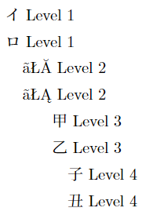
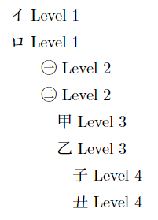
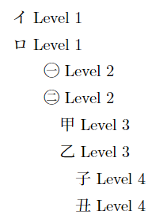
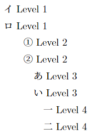

# Using Japanese counter styles in enumerated lists

Enumeration is normally customized with the `enumitem` package. To use Japanese counter styles, two methods are available.

## Using Babel

Enumeration can be customized using [Babel](https://latex3.github.io/babel/)'s locale-specific counters, as long as they are protected (`\protect`).

Typesetting [`babel.tex`](babel.tex) (uncommenting the first lines as appropriate) produces the following:

pLaTeX|upLaTeX|LuaLaTeX
------|-------|--------
||

Note that pLaTeX manages to compile successfully, but produces garbage for Level 2 due to the characters not being supported by the pTeX engine.

## Using `\alph` syntax

Custom counter styles can be defined using `\alph` [syntax](https://tex.stackexchange.com/questions/529813/how-to-define-counters-with-arbitrary-alphabet). The [`enumitem_extended`](https://github.com/tetsu-osaka-physics/tetsu_physic) package (only supports (u)pLaTeX) uses this to produce Japanese counters.

Typesetting [`enumitem_extended.tex`](enumitem_extended.tex) produces the following:

