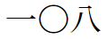
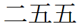

# Japanese TeX Engines

## About the engines

There are three main engines available for typesetting Japanese documents:

- *pTeX* is a TeX engine designed for typesetting Japanese. It uses special mechanisms to support the conventions of Japanese typesetting, which cannot be provided through a normal package.

- *upTeX* is the unicode version of pTeX. Its existence effectively makes pTeX obselete, other than for legacy purposes. pTeX seems to be able to handle files encoded in UTF-8 these days, but unlike upTeX, it will fail if the input contains characters that did not exist in its original encoding.

- The `luatexja` package implements pTeX primitives in the *LuaTeX* engine. This is possible through the use of Lua callbacks, enabling the implementation of features which cannot be built with TeX primitives alone.

upTeX and LuaTeX each have their own strengths. upTeX uses the pLaTeX2ε format, while LuaTeX uses the more common LaTeX2ε format. This means that some packages written for pTeX will refuse to work with LuaTeX, and vice versa. LuaTeX is more compatible with modern packages, with many specifically taking advantage of LuaTeX's built-in Lua interpreter.

I would recommend sticking with LuaTeX unless a (u)pTeX-specific package is required. LuaTeX is the future, and `luatexja` is  mature enough to be the default choice.

## Preamble

If using (u)pTeX, the `plautopatch` package should be loaded at the beginning of the document, in order to automatically resolve incompatibilites between (u)pTeX and certain western LaTeX packages.

When using upTeX specifically, `uplatex` should be specified as a global option, in order to enable upLaTeX-specific behavior in (u)pLaTeX packages.

Additionally, because (u)pTeX outputs to DVI, it is good to specify the DVI driver as a package option. If the paper size is changed, or the `landscape` option is passed to the document class, the DVI driver will not automatically detect that the dimensions have been changed. When a paper size option is used, loading the `bxpapersize` package will ensure that the DVI driver uses the correct dimensions.

With LuaTeX, there are no packages which are "always" required (with the exception of `luatexja` itself, which is usually loaded by the document class).

pLaTeX:

```latex
\RequirePackage{plautopatch}
\documentclass[dvipdfmx]{jsarticle}
```

upLaTeX (landscape document):

```latex
\RequirePackage{plautopatch}
\documentclass[uplatex, dvipdfmx, landscape]{jsarticle}
\usepackage{bxpapersize}
```

> Note: `\RequirePackage` is used in order to load a package before the document class.

## Compilation

### (u)pLaTeX

Compilation is done in two steps (remove the initial 'u' if using pTeX):

```shell
uplatex -kanji=utf8 -no-guess-input-enc file.tex
dvipdfmx file.dvi
```

The flags are used to ensure that the input is interpreted as UTF-8. By default, (u)pTeX will attempt to guess the encoding, with varying degrees of success. More information about this behavior can be found [here](https://texwiki.texjp.org/?upTeX%2CupLaTeX#rfce644f) (in Japanese).

### LuaLaTeX

Compilation is done in a single step:

```shell
lualatex file.tex
```

## pTeX Primitives

pTeX and its descendants define many primitives, some of which have user-level applications. These primitives are always available in (u)pTeX, and whenever `luatexja` is loaded in LuaTeX. If writing plain TeX rather than LaTeX, this is done with `\input luatexja.sty`.

One example of such a primitive is the `\kansuji` primitive, which converts numbers to kanji-digit form. Note that TeX primitives do not delimit arguments using braces (unlike LaTeX macros). `"` tells TeX to interpret a number in hexadecimal form.

`\kansuji108` | `\kansuji"FF`
-------------|--------------
 | 
