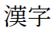
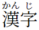

# Japanese LaTeX Packages

Suggested packages for commonly used features.

## Package naming conventions

The following naming schemes are sometimes used with Japanese packages:

- Names starting with *BX* are used for engine-indepent packages. *BX* appears to stand for "Babel Extension".
- Names starting with *PX* are used for packages designed for (u)pTeX, though some of them also support LuaTeX, thanks to `luatexja`.

## Font selection

### Description

Packages that change which font will be used in the final document. This is independent of which weights are available.

The default fonts are the [Harano Aji](https://ctan.org/pkg/haranoaji) fonts, which are based on the [Source Han](https://www.youtube.com/watch?v=6QH2mJVOOzM) fonts by Adobe. These are some of the best fonts available for Japanese, as they look good while having *excellent* glyph coverage.

### Packages

#### LuaLaTeX

- `luatexja-fontspec`
  - Used to configure custom fonts for use with Japanese.
  - Bundled with [luatexja](https://www.ctan.org/pkg/luatexja).

- `luatexja-preset`
  - Provides presets for popular fonts. Loads `luatexja-fontspec` internally.
  - Bundled with [luatexja](https://www.ctan.org/pkg/luatexja).

#### (u)pLaTeX

- [PXchfon](https://www.ctan.org/pkg/pxchfon)
  - Used to configure custom fonts. Also provides presets for popular fonts.

## Multiple font weights

### Description

By default, only two fonts are available; a regular-weight *mincho* font and a bold *gothic* font. This means that switching to a bold font will automatically switch to *gothic* and vice versa. Using one of these packages will enable bold *mincho*, etc. The following table demonstrates the difference.

`\mnfamily\mdseries`|`\mnfamily\bfseries`|`\gtfamily\mdseries`|`\gtfamily\bfseries`
 -------------------|--------------------|--------------------|--------------------
 |  |  | 
 |  |  | 

### Packages

#### LuaLaTeX

- `luatexja-fontspec` w/ `deluxe` option
  - Use this if selecting the font using `luatexja-fontspec`.
  - Bundled with [luatexja](https://www.ctan.org/pkg/luatexja).
- `luatexja-preset` w/ `deluxe` option
  - Use this if selecting the font using `luatexja-preset`.
  - Bundled with [luatexja](https://www.ctan.org/pkg/luatexja).

#### (u)pLaTeX

- [jlreq-deluxe](https://www.ctan.org/pkg/jlreq-deluxe)
  - Use this if using the `jlreq` class. `jlreq` uses a custom font metric which will be overwritten if the `otf` package is loaded.
    - Details available [here](https://gist.github.com/h20y6m/4f04a5b44179b80c51353832ce41bc61).
- [otf](https://www.ctan.org/pkg/japanese-otf) w/ `deluxe` option
  - Standard choice for (u)pLaTeX.

## Glyph variants

### Description

The 2004 revision of the Japanese standard [JIS X 2013](https://en.wikipedia.org/wiki/JIS_X_0213) famously changed the recommended renderings of 168 kanji. These newer forms are known as the JIS2004 forms, with the older forms being known as the JIS90 forms. The two variants of the character U+990C `餌` are shown below:

JIS90 | JIS2004
------|--------
 | 

Generally speaking, unless you have a reason to use the JIS90 forms, you should probably stick with the JIS2004 forms.

Most modern fonts will default to JIS2004 glyphs, but certain (u)pLaTeX packages can implicitly select the JIS90 forms. Therefore, it is generally a good idea to specify `jis2004` as a global option when using (u)pLaTeX.

### Packages

#### LuaLaTeX

- `luatexja-preset`
  - Preferred glyphs are selected with options `jis2004` and `jis90`.
  - If neither is specified, most fonts will default to JIS2004 glyphs.

#### (u)pLaTeX

Glyphs are selected using either `otf` or `pxchfon`, depending on the circumstances. Both packages will select JIS90 glyphs by default and provide a `jis2004` option for selecting JIS2004 glyphs.

Which option is used is determined as follows:

1. If the `otf` package is loaded without the `noreplace` option, its package option is used.
2. Else, if the font is configured using the `pxchfon` package, its package option is used.
   - This option will *only* apply if the font is *explicitly* set with `pxchfon`. To use it with the default font, use the `haranoaji` preset.
3. Else, the default setting (as set in `updmap.cfg` via `kanji-config-updmap`) is used. On a fresh TeX Live installation, this will be Harano Aji with JIS2004 glyphs.

### Additional information

More information about `updmap` can be found [here](https://www.tug.org/texlive/updmap-kanji.html).

## Character input macros

### Description

These packages define macros for entering characters in special ways.

#### `\UTF` and `\CID`

These macros are used to enter characters using number values.

- `\UTF` is used to enter a Unicode character using its code point.
- `\CID` is used to enter a glyph using its Adobe CID (Character ID).

A single Unicode character can correspond to multiple glyphs due to directional and regional variants. Note how in the following table, `\UTF` produces different glyphs depending on the text direction.

Direction | `\UTF{32FF}` | `\CID{23058}` | `\CID{23059}`
----------|--------------|---------------|--------------
Horizontal|  |  | 
Vertical  |  |  | 

#### `ajMacros`

These packages also define a set of input macros prefixed with *aj*, including but not limited to:

- `ajLig`, used to input square ligatures such as those defined in the [CJK Compatibility](https://en.wikipedia.org/wiki/CJK_Compatibility) block.
  
  `\ajLig{平成}`|`\ajLig{株式会社}`|`\ajLig{キログラム}`
  --------------|----------------|---------------
   |  | 

  Many of these, including [オントロ & グスーム](https://ccjktype.fonts.adobe.com/2019/08/angstrom-square-ligatures.html), are defined, but lack glyphs in many common fonts, as they do not exist in Unicode. Fonts which fully cover Adobe-Japan1 such as *Kozuka Mincho Pr6N*, will contain the necessary glyphs.
  
- Macros for typesetting special typographic symbols:

  `\ajMasu` | `\ajKoto` | `\ajYori`|`\ajKunoji`
  ----------|-----------|----------|-----------
   |  |  | 

### Packages

#### LuaLaTeX

- `luatexja-otf`
  - Only used for providing these features, as weights are managed by `luatexja-fontspec`.
  - Bundled with [luatexja](https://www.ctan.org/pkg/luatexja).

#### (u)pLaTeX

- [jlreq-deluxe](https://www.ctan.org/pkg/jlreq-deluxe)
  - Use this if using the `jlreq` class. Use option `deluxe=false` if you only want the input commands and don't need multiple weights.
- [otf](https://www.ctan.org/pkg/japanese-otf)
  - Standard choice for (u)pLaTeX.

### Additional information

- See the `otf` package [manual](https://psitau.kitunebi.com/otf.html) for the full list of available ligatures and symbols.
- Explanations of typographic symbols:
  - [List of Japanese typographic symbols](https://en.wikipedia.org/wiki/List_of_Japanese_typographic_symbols)
  - [約物](https://ja.wikipedia.org/wiki/%E7%B4%84%E7%89%A9)
  - [ヿ](https://en.wikipedia.org/wiki/Koto_(kana)) and [ゟ](https://en.wikipedia.org/wiki/Yori_(kana))

## Furigana and Kenten

### Description

Packages for entering ruby text (furigana). They also provide macros for typesetting emphasis dots (kenten). The examples below are written for the *PXrubrica* package.

#### Furigana

The `\ruby` command is used for entering ruby text. Options can be used to typeset ruby on a per-kanji basis or for the entire sequence.

- `\ruby[m]{漢字}{かん|じ}` produces:

  
- `\ruby[g]{漢字}{かんじ}` produces:

  

Alternatively`\rubysetup{g}` will set `g` as the default. See the [documentation](http://mirrors.ctan.org/language/japanese/pxrubrica/pxrubrica-en.pdf) for details.

#### Kenten

The `\kenten` command is used for adding kenten. Kenten marks can be configured per text direction. Alternate marks can be configured for both directions and are accessed with the `s` option. Kenten marks will be typeset like this by default:

Direction | `\kenten{漢字}` | `kenten[s]{漢字}`
----------|----------------|-----------------
Horizontal|  | 
Vertical  |  | 

### Packages

#### All engines

- [PXrubrica](https://www.ctan.org/pkg/pxrubrica)
  - Compliant with JLREQ and JIS X 4051. Typesets horizontal kenten using "•",  and vertical kenten using "﹅" by default, as [suggested](https://www.w3.org/TR/jlreq/#composition_of_emphasis_dots) by JLREQ.

#### LuaLaTeX

- `luatexja-ruby`
  - Uses Lua callbacks. Always uses "•" to typeset kenten, regardless of direction. Included here for the sake of completeness; *PXrubrica* is recommended.
  - Bundled with [luatexja](https://www.ctan.org/pkg/luatexja).

### Additional information

- [Japanese documentation](http://mirrors.ctan.org/language/japanese/pxrubrica/pxrubrica.pdf) for *PXrubrica*.
- [Blogpost](https://zrbabbler.hatenablog.com/entry/20170503/1493818510) by ZR (the developer of *PXrubrica*).
- [Explanation](https://www.japanesewithanime.com/2018/03/furigana-dots-bouten.html) of what emphasis dots are.

## Macros for vertical typesetting

### Description

These packages provide macros that enhance vertical typesetting. Among other things, they extend the `tabular` and `minipage` environments for vertical use, and provide the following commands:

- `\kasen` is the vertical equivalent of underlining. `\kasen{漢字}` produces:

  

- `\rensuji` is used to place horizontal numbers (or any characters) in vertical text. `\rensuji{1}月\rensuji{27}日` produces:

    

An example of typesetting vertical tables can be found [here](https://lualatexlab.blog.fc2.com/blog-entry-63.html).

### Packages

#### LuaLaTeX

- `lltjext`
  - Bundled with [luatexja](https://www.ctan.org/pkg/luatexja).

#### (u)pLaTeX

- `plext`
  - Bundled with [pLaTeX](https://www.ctan.org/tex-archive/language/japanese/platex).

## Miscellaneous

### All engines

- [Babel](https://www.ctan.org/pkg/babel-japanese)
  - Babel isn't actually needed for Japanese most of the time, as the Japanese document classes perform many of its functions. As such, Babel is mainly useful for:
    - Writing multilingual documents.
    - Using Japanese counter styles (see [this article](./enumeration.md)).

- [BXjaholiday](https://www.ctan.org/pkg/bxjaholiday)
  - Converts dates to names of Japanese holidays.

- [BXjalipsum](https://www.ctan.org/pkg/bxjalipsum)
  - Provides Japanese dummy text (Lorem Ipsum).

- [BXwareki](https://www.ctan.org/pkg/bxwareki)
  - Converts dates after 1873 (when Japan adopted the Gregorian calendar) to Japanese calendar format.

- [endnotesj](https://ctan.org/pkg/endnotesj)
  - Japanese version of the [endnotes](https://www.ctan.org/pkg/endnotes) packages, including support for vertical typesetting.

- [gckanbun](https://www.ctan.org/pkg/gckanbun)
  - Macros for typesetting Kanbun/漢文.

### LuaTeX

- [kanbun](https://www.ctan.org/pkg/kanbun)
  - Newer Kanbun package for LuaTeX with less verbose syntax. Can technically be used with other engines, but doing so requires a different, more complicated syntax.

### (u)pLaTeX

- [BXpapersize](https://www.ctan.org/pkg/bxpapersize)
  - Synchronizes the DVI driver's paper size with the document's papersize. Settings such as `\documentclass[landscape]{jlreq}` only apply to the TeX engine when producing its DVI output.
  
    The DVI driver needs be configured separately, as it will otherwise do the equivalent of photocopying a landscape document onto a paper with portrait orientation. This package embeds the commands for adjusting the DVI driver's paper size into the DVI output.

- `minijs`
  - Applies *jsclasses*-like settings to other document classes. Useful when using non-Japanese document classes like `beamer` with pLaTeX.
    - Loads the *jis* font metric when using pLaTeX (upLaTeX uses a *jis*-based font metric by default).
    - Enables the synchronized font-switching behavior of the *js* classes in either engine.
  - Not required when using the `otf` package, which loads its own font metrics.
  - Bundled with [jsclasses](https://www.ctan.org/pkg/jsclasses).

- [plautopatch](https://ctan.org/pkg/plautopatch)
  - Automatically applies compatibility patches when loading certain LaTeX packages in order to resolve incompatibilites with (u)pLaTeX. Usually loaded at the beginning of every (u)pLaTeX document with `\RequirePackage`.
