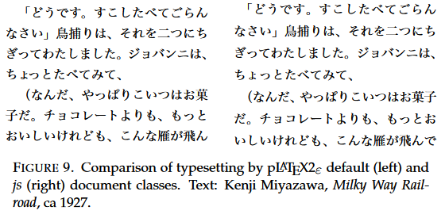
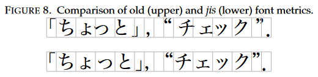
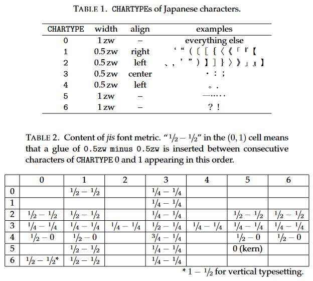
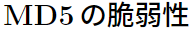

# *js* classes and the *jis* font metric

**NOTE:** All quotes and images are from [*pTeX and Japanese Typesetting*](#references).

The *js* classes are a set of document classes created by Haruhiko Okumura.

They are improved versions of the default *"j"* classes with the goal of  implementing JIS X 4051 (the Japanese Industrial Standard for typesetting). This is achieved in two ways:

- Through the use of the *jis* font metric.
- Through changing some of the document settings.

The result of these differences can be observed in the following image:

>
>
> Figure 9 compares typesetting results by the pLaTeX2ε default (left) and the *js* document classes. We notice that the `\baselineskip` is wider for *js* (which is not significant here), that the combination of two small *hiragana* “ょっ” is too tight for the default class (a well-known bug of the old font metric), and that the apparent indentation is 1.5 zw, not 1 zw, for the default class, when a halfwidth quotation mark or a parenthesis begins the paragraph.

## *jis* font metric

The *jis* font metric is a Japanese Font Metric (JFM) designed to conform to JIS X 4051.

The font metric appears to mainly affect glue placement and sizing. Some of the more noteable differences between the *jis* font metric and the pTeX default can be observed in the following image. Note how the old font metric places gaps before the comma and inside of the quotation marks. Also note how the small kana are not the correct width.

> 
>
> We have not provided thorough comparisons of the old and *jis* font metrics. Suffice it to give a small example, Figure 8, for a casual comparison. Note that *jis* font metric tries to conserve fullwidth-ness of Japanese characters but avoids large voids by cutting halfwidth spaces off them.

The following tables provide more details on how the font metric determines where to place glues. In cases where no glue is specified, the system may insert `\kanjiskip` or `\xkanjiskip` instead.

> 
>
> Because there are thousands of Japanese characters, a pairwise glue/kern table is prohibitive. pTeX has an extended font metric format, often called JFM (Japanese Font Metric), that groups characters into several CHARTYPEs and specifies glue/kern insertions for each pair of groups.

## *js* classes

Aside from using the *jis* font metric, the *js* classes also change some settings compared to the default classes. A couple of examples are provided.

### Default values

Some of the default values are changed, including:

- The size of Japanese fonts are changed.

    > The 10-point *js* document classes use 10 pt (about 3.5146 mm; 1 pt = 1/72.27 in for TeX and pTeX) Latin font with 13 Q (13 quarter-millimeter = 3.25 mm) Japanese font. The choice is partly derived from the fact that many Japanese books are typeset with 13 Q fonts. The original choice by the pTeX developers was 9.62216 pt (about 3.3818 mm) Japanese for 10 pt Latin.

- The width of `\kanjiskip` is changed.

    > Despite the name, `\kanjiskip` is inserted between any adjacent Japanese characters, *kanji* or otherwise, except when the font metric inserts a glue or kern, as explained later. The natural width of `\kanjiskip` is usually set to zero. The original pTEX setting was `0pt plus .4pt minus .5pt`, but since it is desirable that the glue cannot shrink so much as it can stretch, *js* classes set it to `0zw plus .1zw minus .01zw`.

- The length of `\baselineskip` is changed.

    > Another consideration is that `\baselineskip` must be wider for Japanese text. Whereas plain TeX and LaTeX sets it to 12 pt, the pLaTeX2ε default document classes sets it to 15 pt (17 pt) for horizontal (vertical) typesetting, and js document classes (horizontal) set it to 16 pt.

### Dynamic lengths

Certain lengths are redefined whenever the font size is changed, in order to maintain proper text alignment.

> Note that the unit “zw” is defined with respect to the current font. If we set `\parindent` to 1 zw at the beginning of the document where `\normalsize` is in effect, and if we compose a paragraph with a `\small` font, then the indentation becomes greater than 1 zw of the current `\small size`, and the paragraph will look ugly. To prevent this, *js* document classes redefine the `\@setfontsize` command so as to set `\parindent`, `\kanjiskip`, and `\xkanjiskip` to the appropriate values with respect to the selected font size.

### Headings

The default classes use *gothic* fonts for headings, but do not use *sans* fonts for Latin text. The *js* classes fix this inconsistency.

Compare the output of

```latex
\section{MD5の脆弱性}
```

using:

- `jarticle`:

    

- `jsarticle`:

    

> This means that Japanese document classes must set headers with `\sffamily` and `\gtfamily`, and possibly `\bfseries` (although `\bfseries` has effect only when the four fonts in Table 3 are accessible). This serif/sans-serif consistency is one of the most conspicuous improvement of *js* over the default pLaTeX2ε classes.

## Conclusion

If writing horizontal documents, *js* classes are preferable over the default equivalents:

- For pLaTeX, use `jsarticle` instead of `jarticle`.
- For upLaTeX, use `jsarticle` *with the `uplatex` argument* instead of `ujarticle`.
- For LuaLaTeX, use `ltjsarticle` instead of `ltjarticle`.

As *js* classes are not available for vertical documents, there are effectively two options:

- [Hack](https://tex.stackexchange.com/questions/233736/uplatex-and-line-indentation-tbook) the relevant *js* class into producing vertical output.
  - Takes more work but will most likely produce better output.
- Use the default vertical classes, `(u)tarticle` and `ltjtarticle`.
  - The font metric can be replaced in order to improve the quality of the final document:
    - With (u)pLaTeX, loading the `otf` package will overwrite the font metric with one that is based on the *jis* font metric.
    - `luatex-ja` actually uses a font metric based on the `otf` package by default.
  - Will most likely still require tweaking of the settings in order to compensate for the missing *js* class settings.

Because of this it is recommended to use the `jlreq` class for vertical documents. It is also just as good as the *js* classes for typesetting horizontal documents, and has the advantage of being compatible with all engines.

## References

Unless otherwise stated, all information taken from:

- Haruhiko Okumura, [*"pTeX and Japanese Typesetting"*](http://ajt.ktug.org/2008/0201okumura.pdf), The Asian Journal of TeX, Volume 2, No. 1, 2008.
